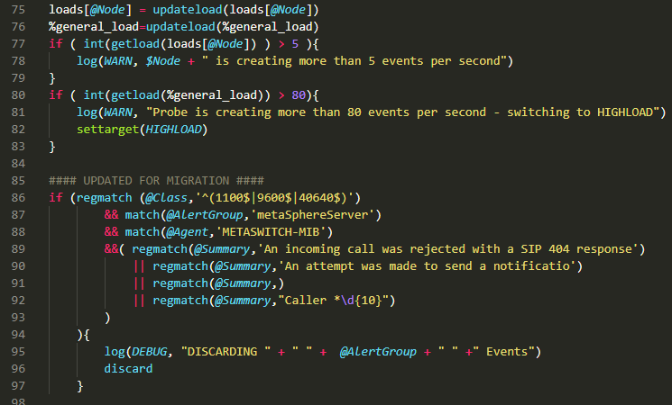

# Netcool Probe Rules File VSCode Language

This Language extension is designed to provide syntax hylighting for IBM Netcool/Tivoli proprietary .rules files used for Objectserver Probes.

## Features
- Syntax Highlighting for .rules files.

Added as many known functions and operators as I could locate including the ones found here:
https://www.ibm.com/support/knowledgecenter/SSSHTQ_8.1.0/com.ibm.netcool_OMNIbus.doc_8.1.0/omnibus/wip/probegtwy/reference/omn_prb_rulesfilefncs.html

## Requirements
N/A

## Bugs
Please report any bugs [here](https://github.com/TheGreatSardini/ibm_rules_extension/issues) 

## Changelog and Release Information
See the [Changelog](CHANGELOG.md)  

## Acknowledgements
Inspired by [rules-code](https://github.com/lichtwellenreiter/rules-code/issues)

IBM Tivoli Netcool is a Trademark owned by IBM.
This Language extension is meant to aid in the creation and editing of Probe rules files using VSCode
